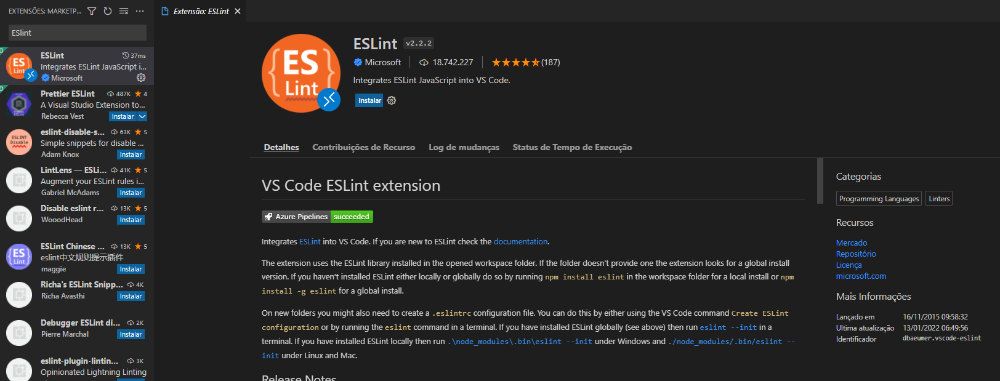

# Módulo 01

## Exercício 02 - Adiciona ESLint no projeto

### Tarefas
1. Pelo terminal, acessar o projeto **chatcollab** no Desktop (área de trabalho) do seu SO;
2. Instalar o Eslint;

### Passo a passo
#### 1. Acessar a pasta do projeto

Abra o terminal do seu SO, se estiver no Windows use o Power Shell, Git BASH ou similares para que o comando do Linux funcione. Se estiver no Linux ou Mac, ambos têm comandos muitos similares. Agora que você já está com o seu terminal aberto vamos executar os seguintes passos:

Entre no Desktop com o comando a seguir:
```bash
cd ~/Desktop
```

Acessar a pasta **chatcollab**:
```bash
~/Desktop$ cd chatcollab
```

#### 2. Instalar o Eslint

Sempre quando vamos instalar alguma coisa temos que olhar o [site oficial](https://eslint.org/) e procucar o [Getting Started](https://eslint.org/docs/user-guide/getting-started)

Como queremos utilzar o `yarn` vamos utilizar o comando `yarn create @eslint/config`

```bash
~/Desktop/chatcollab$ yarn create @eslint/config
```

As perguntas que o comando vai fazer e as respectivas respostas estão a baixo:
```bash
? How would you like to use ESLint? …
  To check syntax only
  To check syntax and find problems
> To check syntax, find problems, and enforce code style

✔ How would you like to use ESLint? · style
? What type of modules does your project use? …
> JavaScript modules (import/export)
  CommonJS (require/exports)
  None of these

✔ How would you like to use ESLint? · style
✔ What type of modules does your project use? · esm
? Which framework does your project use? …
> React
  Vue.js
  None of these

✔ How would you like to use ESLint? · style
✔ What type of modules does your project use? · esm
✔ Which framework does your project use? · react
? Does your project use TypeScript? > No / Yes

✔ How would you like to use ESLint? · style
✔ What type of modules does your project use? · esm
✔ Which framework does your project use? · react
✔ Does your project use TypeScript? · No / Yes
? Where does your code run?
> Browser
  Node

✔ How would you like to use ESLint? · style
✔ What type of modules does your project use? · esm
✔ Which framework does your project use? · react
✔ Does your project use TypeScript? · No / Yes
✔ Where does your code run? · browser
? How would you like to define a style for your project? …
> Use a popular style guide
  Answer questions about your style

✔ How would you like to use ESLint? · style
✔ What type of modules does your project use? · esm
✔ Which framework does your project use? · react
✔ Does your project use TypeScript? · No / Yes
✔ Where does your code run? · browser
✔ How would you like to define a style for your project? · guide
? Which style guide do you want to follow? …
> Airbnb: https://github.com/airbnb/javascript
  Standard: https://github.com/standard/standard
  Google: https://github.com/google/eslint-config-google
  XO: https://github.com/xojs/eslint-config-xo

✔ How would you like to use ESLint? · style
✔ What type of modules does your project use? · esm
✔ Which framework does your project use? · react
✔ Does your project use TypeScript? · No / Yes
✔ Where does your code run? · browser
✔ How would you like to define a style for your project? · guide
✔ Which style guide do you want to follow? · airbnb
? What format do you want your config file to be in? …
  JavaScript
  YAML
> JSON

✔ How would you like to use ESLint? · style
✔ What type of modules does your project use? · esm
✔ Which framework does your project use? · react
✔ Does your project use TypeScript? · No / Yes
✔ Where does your code run? · browser
✔ How would you like to define a style for your project? · guide
✔ Which style guide do you want to follow? · airbnb
✔ What format do you want your config file to be in? · JSON
Checking peerDependencies of eslint-config-airbnb@latest
Local ESLint installation not found.
The config that you've selected requires the following dependencies:

eslint-plugin-react@^7.28.0 eslint-config-airbnb@latest eslint@^7.32.0 || ^8.2.0 eslint-plugin-import@^2.25.3 eslint-plugin-jsx-a11y@^6.5.1 eslint-plugin-react-hooks@^4.3.0
✔ Would you like to install them now with npm? · No / Yes

```

Se tudo deu certo você receberá uma saída similar no seu terminal:
```bash
1 package is looking for funding
  run `npm fund` for details
found 0 vulnerabilities
Successfully created .eslintrc.json file in /Users/marcobruno/Desktop/chatcollab
Done in 71.19s.
```

Para ver o conteúdo do arquivo **.eslintrc.json** podemos executar o comando a baixo:

```bash
cat .eslintrc.json
```
```JSON
{
    "env": {
        "browser": true,
        "es2021": true
    },
    "extends": [
        "plugin:react/recommended",
        "airbnb"
    ],
    "parserOptions": {
        "ecmaFeatures": {
            "jsx": true
        },
        "ecmaVersion": "latest",
        "sourceType": "module"
    },
    "plugins": [
        "react"
    ],
    "rules": {
    }
}
```

Eu gosto de remover a extenção .json do arquivo `.eslintrc.json` ficando `.eslintrc` e como estamos utilizando o yarn podemos remover o package-lock.json também


Se abrirmos nosso projeto no Visual Code não vemos nenhuma diferença, para podermos ver o eslint trabalhar temos que instalar um Plugin nele.

- [ESLint](https://marketplace.visualstudio.com/items?itemName=dbaeumer.vscode-eslint)

No terminal e dentro da pasta **chatcollab** execute o comando a seguir, ele irá abrir o VS Code já com o nosso projeto

```bash
code .
```

Vá para a opção de extensões `(Ctrl+Shift+X)` representado pelo icone  e digite `ESlint` e depois clicar em instalar



Ainda temos que resolver um problema mais isso fica para a próxima aula

 
 |Exercício anterior| HOME |Próximo exercício|
|:-|:----:|----------------:|
|[Iniciar projeto com ViteJS](modulo-01-exercicio-01.md)|[Readme.md](README.md)|[Adiciona Prettier no Projeto](modulo-01-exercicio-03.md)|