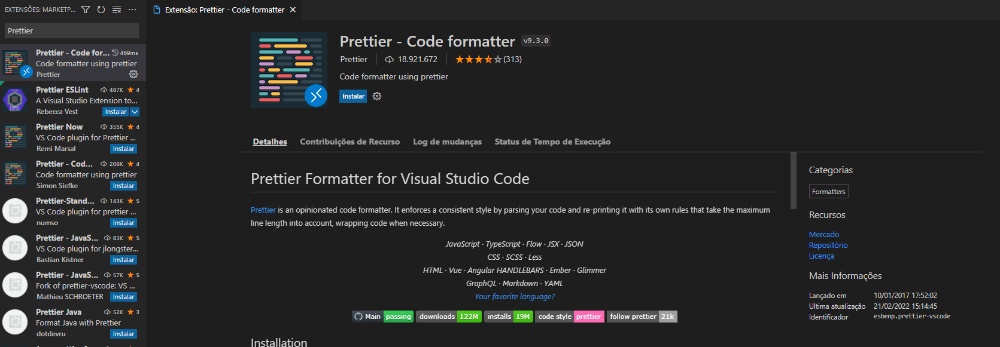

# Módulo 01

## Exercício 03 - Adiciona Prettier no Projeto

### Tarefas
1. Pelo terminal, acessar o projeto **chatcollab** no Desktop (área de trabalho) do seu SO;
2. Instalar o Prettier;

### Passo a passo
#### 1. Acessar a pasta do projeto

Abra o terminal do seu SO, se estiver no Windows use o Power Shell, Git BASH ou similares para que o comando do Linux funcione. Se estiver no Linux ou Mac, ambos têm comandos muitos similares. Agora que você já está com o seu terminal aberto vamos executar os seguintes passos:

Entre no Desktop com o comando a seguir:
```bash
cd ~/Desktop
```

Acessar a pasta **chatcollab**:
```bash
~/Desktop$ cd chatcollab
```

#### 2. Instalar o Prettier

Sempre quando vamos instalar alguma coisa temos que olhar o [site oficial](https://prettier.io/) para nos auxiliar na pesquisa vamos utilizar o termo `prettier with eslint` um dos resultados é a página [Integrating with linters](https://prettier.io/docs/en/integrating-with-linters.html) onde temos o link [eslint-config-prettier](https://github.com/prettier/eslint-config-prettier) que nos mostra como instalar o Prettier com o `npm install --save-dev eslint-config-prettier`

Como queremos utilzar o `yarn` vamos alterar o comando para  `yarn add -D eslint-config-prettier prettier` você reparou que adicionamos o `prettier` apesar de não estar na documentação para evitar eventuais problemas já adicionamos ele também como uma dependência do projeto.

```bash
~/Desktop/chatcollab$ yarn add -D eslint-config-prettier prettier
```

Se tudo deu certo você receberá uma saída similar no seu terminal:

```bash
├─ which-boxed-primitive@1.0.2
├─ which@2.0.2
└─ word-wrap@1.2.3
Done in 38.96s.
```

Como fizemos no caso do `ESLint` temos que instalar um plugin para o `Prettier` também.

- [Prettier - Code formatter](https://marketplace.visualstudio.com/items?itemName=esbenp.prettier-vscode)

No terminal e dentro da pasta **chatcollab** execute o comando a seguir, ele irá abrir o VS Code já com o nosso projeto

```bash
code .
```

Vá para a opção de extensões `(Ctrl+Shift+X)` representado pelo icone  e digite `Prettier` e depois clicar em instalar



Depois disso na teoria já era para aparecer no canto inferior direito a `Prettier` e ele estar funcionando... mas não é bem assim ainda precissamos fazer algumas configurações

Vamos alterar o arquivo de configuração do ESLint para ele trabalhar com o Prettier, para isso iremos abrir o arquivo `.eslintrc` e adicionar o texto *`"prettier"`* depois do *`"airbnb"`* na sessão extends ficando conforme é mostrado a baixo:
```JSON
{
    "env": {
        "browser": true,
        "es2021": true
    },
    "extends": [
        "plugin:react/recommended",
        "airbnb",
        "prettier"
    ],
    "parserOptions": {
        "ecmaFeatures": {
            "jsx": true
        },
        "ecmaVersion": "latest",
        "sourceType": "module"
    },
    "plugins": [
        "react"
    ],
    "rules": {
    }
}
```

Agora vamos alterar algumas configurações do Visual Studio Code

`(Ctrl + Shift + P)` e procurar o termo *`format`* e nas opções temos que clicar no item *`File: Save without Formatting`*

O que isso está fazendo para você, se você digitar `(Ctrl + ,)` vai abrir a tela de Configurações do Visual Studio Code se você olhar o botão  você verá que tem um trecho com o código a baixo

```JSON
...

    "editor.formatOnSave": true,
    "[javascriptreact]": {
        "editor.defaultFormatter": "esbenp.prettier-vscode"
    }
...
```

Com isso sempre que salvamos o arquivo ele utiliza o `Prettier` para formatar-lo

|Exercício anterior| HOME |Próximo exercício|
|:-|:----:|----------------:|
|[Adiciona ESLint no projeto](modulo-01-exercicio-02.md)|[Readme.md](README.md)|[Pasta .vscode para um mundo dev mais feliz](modulo-01-exercicio-04.md)|